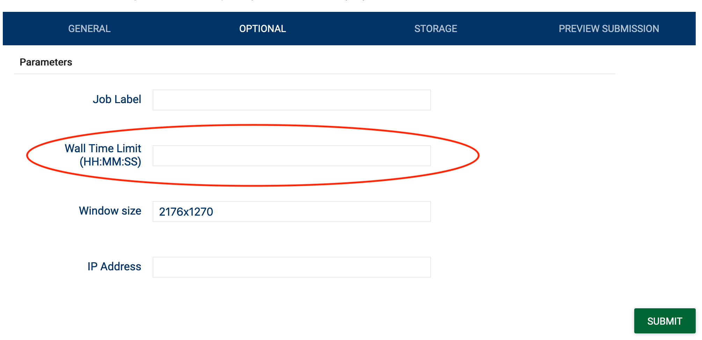

# How do check for hardware availability on the NIMBIX cloud?

Check the [status page](https://status.jarvice.com/) for hardware availability on the NIMBIX cloud. The machine types with Xilinx FPGAs are listed as `NX*`

# My job remains in the `Starting` status on the JARVICE portal. How do I connect to the job?

Please contact [NIMBIX support (support@nimbix.net)](mailto:support@nimbix.net) with your job number for assistance.

# How do I transfer files to/from my job?

Files can be transferred to/from your job using either `sftp` or the using the `JARVICE File Manager`. Please refer to [this post](https://nimbix.zendesk.com/hc/en-us/articles/208083526-How-do-I-transfer-files-to-and-from-JARVICE-) for additional information.

# My browser is having performance issues connecting to a job. Is there a VNC player available?

Yes, [TigerVNC](https://tigervnc.org/) can be used to connect to VNC enabled jobs.

# I accidentally left a job running unattended. Is there a way to limit compute time for jobs?

Yes, fill in the `Wall Time Limit` under the `OPTIONAL` Parameters (see image below). **NOTE** The job will be terminated immediately without warning when the time limit has expired. All data outside of the vault (`/data`) will be lost.

# My job has encountered an error. What should I do?

Please contact [NIMBIX support (support@nimbix.net)](mailto:support@nimbix.net) with your job number for assistance.
