# PushToCompute CI/CD flow for Xilinx Alveo

Custom JARVICE applications utilizing Alveo accelerators can be created following the [PushToCompute CI/CD flow](https://jarvice.readthedocs.io/en/latest/cicd/). The Xilinx Runtime (XRT) supports the following Linux distributions:

* Ubuntu Xenial (16.04)
* Ubuntu Bionic (18.04)
* CentOS 7.4.1708

The examples on this page will walk through how to create minimal and desktop environments. Each example will create an [AppDef](https://jarvice.readthedocs.io/en/latest/appdef/) to specify available machine types and commands. The Application Definition(AppDef) describes the applications interface for applications that are deployed on JARVICE with PushToCompute.

## Requirements

The examples on this page assume users are using a terminal on Linux or MacOS. The following 3rd party applications are required:

* Docker CE or EE: https://docs.docker.com/install/
* Docker registry: [DockerHub](https://hub.docker.com/) offers free accounts for public repositories

# Minimal Containers

Minimalist containers can be created directly from DockerHub official images. The resulting JARVICE applications will start a [gotty](https://github.com/yudai/gotty) terminal during `/sbin/init`.

## Minimal Ubuntu Xenial XRT

### Create XRT Docker image

The following script will create a simple base XRT application. Save this locally as `build-xrt.sh` in it own directory (e.g. `/tmp/build-xrt`) 

```bash
#!/bin/bash

DOCKER_TAG=${1:-xrt-test}
OS_DIST=${2:-16.04}
BASE_IMAGE=${3:-ubuntu:xenial}
XILINX_RELEASE=${4:-201920.2.3.1301}

XRT_RUNTIME=xrt_${XILINX_RELEASE}_${OS_DIST}-xrt.deb
# Create an AppDef for JARVICE
# Server command will start gotty via /sbin/init
cat << EOF > AppDef.json
{
    "name": "xilinx_base_xrt",
    "description": "Minimal XRT application for Alveo",
    "author": "example",
    "walltime": "00:30:00",
    "licensed": true,
    "classifications": [
        "FPGA",
        "Alveo"
    ],
    "machines": [
        "nx*u*"
    ],
    "vault-types": [
        "FILE",
        "BLOCK",
        "BLOCK_ARRAY",
        "OBJECT"
    ],
    "commands": {
        "Server": {
            "path": "/sbin/init",
            "interactive": true,
            "name": "Server",
            "description": "Launch a session with all boot services, including SSH (if installed).  Connection address and credentials will appear in your web browser once available.",
            "parameters": {}
        }
    },
    "image": {
        "data": "",
        "type": "image/png"
    }
}
EOF
# Create Docker container w/ Xilinx Runtime
cat << EOF > Dockerfile
FROM ${BASE_IMAGE} 
ADD https://www.xilinx.com/bin/public/openDownload?filename=${XRT_RUNTIME} /xrt.deb
RUN apt-get update && apt install -y /xrt.deb curl
RUN rm /xrt.deb
ADD AppDef.json /etc/NAE/AppDef.json
RUN curl --fail -X POST -d @/etc/NAE/AppDef.json https://api.jarvice.com/jarvice/validate
EOF
# Build Docker image
docker build -t ${DOCKER_TAG} ${PWD}
```

We can build the Ubuntu Docker container with:

```bash
cd /tmp/build-xrt
chmod +x build-xrt.sh
./build-xrt.sh
```

Note: `build-xrt.sh` may require `sudo` permissions to use docker. Add your Linux user to the `docker` group to avoid elevated permissions

By default, `build-xrt.sh` will tag an image locally called `xrt-test`.

`docker images | grep xrt-test`

This image will need to be pushed to a Docker registry to use with PushToCompute. This example will use [DockerHub](https://hub.docker.com/).

Set `DOCKER_USER` to your DockerHub account

```
DOCKER_USER=<your-DockerHub-account>
```

Tag and push the XRT Docker image to DockerHub

```bash
docker tag xrt-test ${DOCKER_USER}/xrt-test:minimal
docker push ${DOCKER_USER}/xrt-test:minimal
```

Note: New pushes to DockerHub will create a **public** repository by default. You must create a private repository before pushing to it if you do not wish your images to be public.

The new XRT docker image will now be available on your Docker registry. 

[Create your new JARVICE App](#create-a-new-jarvice-application-with-pushtocompute)

## Minimal Ubuntu Bionic XRT

Follow the same steps in [Minimal Ubuntu 16.04 XRT](#minimal-ubuntu-xenial-xrt) with the following `build-xrt.sh`:

```bash
#!/bin/bash

DOCKER_TAG=${1:-xrt-test}
OS_DIST=${2:-18.04}
BASE_IMAGE=${3:-ubuntu:bionic}
XILINX_RELEASE=${4:-201920.2.3.1301}

XRT_RUNTIME=xrt_${XILINX_RELEASE}_${OS_DIST}-xrt.deb
# Create an AppDef for JARVICE
# Server command will start gotty via /sbin/init
cat << EOF > AppDef.json
{
    "name": "xilinx_base_xrt",
    "description": "Minimal XRT application for Alveo",
    "author": "example",
    "walltime": "00:30:00",
    "licensed": true,
    "classifications": [
        "FPGA",
        "Alveo"
    ],
    "machines": [
        "nx*u*"
    ],
    "vault-types": [
        "FILE",
        "BLOCK",
        "BLOCK_ARRAY",
        "OBJECT"
    ],
    "commands": {
        "Server": {
            "path": "/sbin/init",
            "interactive": true,
            "name": "Server",
            "description": "Launch a session with all boot services, including SSH (if installed).  Connection address and credentials will appear in your web browser once available.",
            "parameters": {}
        }
    },
    "image": {
        "data": "",
        "type": "image/png"
    }
}
EOF
# Create Docker container w/ Xilinx Runtime
cat << EOF > Dockerfile
FROM ${BASE_IMAGE} 
ADD https://www.xilinx.com/bin/public/openDownload?filename=${XRT_RUNTIME} /xrt.deb
RUN apt-get update && apt install -y /xrt.deb curl
RUN rm /xrt.deb
ADD AppDef.json /etc/NAE/AppDef.json
RUN curl --fail -X POST -d @/etc/NAE/AppDef.json https://api.jarvice.com/jarvice/validate
EOF
# Build Docker image
docker build -t ${DOCKER_TAG} ${PWD}
```

## Minimal CentOS 7.4.1708 XRT

Follow the same steps in [Minimal Ubuntu 16.04 XRT](#minimal-ubuntu-xenial-xrt) with the following `build-xrt.sh`:

```bash
#!/bin/bash

DOCKER_TAG=${1:-xrt-test}
OS_DIST=${2:-7.4.1708}
BASE_IMAGE=${3:-centos:7.4.1708}
XILINX_RELEASE=${4:-201920.2.3.1301}

XRT_RUNTIME=xrt_${XILINX_RELEASE}_${OS_DIST}-xrt.rpm
# Create an AppDef for JARVICE
# Server command will start gotty via /sbin/init
cat << EOF > AppDef.json
{
    "name": "xilinx_base_xrt",
    "description": "Minimal XRT application for Alveo",
    "author": "example",
    "walltime": "00:30:00",
    "licensed": true,
    "classifications": [
        "FPGA",
        "Alveo"
    ],
    "machines": [
        "nx*u*"
    ],
    "vault-types": [
        "FILE",
        "BLOCK",
        "BLOCK_ARRAY",
        "OBJECT"
    ],
    "commands": {
        "Server": {
            "path": "/sbin/init",
            "interactive": true,
            "name": "Server",
            "description": "Launch a session with all boot services, including SSH (if installed).  Connection address and credentials will appear in your web browser once available.",
            "parameters": {}
        }
    },
    "image": {
        "data": "",
        "type": "image/png"
    }
}
EOF
# Create Docker container w/ Xilinx Runtime
cat << EOF > Dockerfile
FROM ${BASE_IMAGE} 
ADD https://www.xilinx.com/bin/public/openDownload?filename=${XRT_RUNTIME} /xrt.rpm
RUN yum install -y epel-release && yum install -y /xrt.rpm curl
RUN rm /xrt.rpm
ADD AppDef.json /etc/NAE/AppDef.json
RUN curl --fail -X POST -d @/etc/NAE/AppDef.json https://api.jarvice.com/jarvice/validate
EOF
# Build Docker image
docker build -t ${DOCKER_TAG} ${PWD}
```

## Enable NIMBIX Desktop

Using the Dockerfile from a previous example, add this code block to your `Dockerfile`: 

* For Ubuntu: [image-common](https://github.com/nimbix/image-common#ubuntu-with-nimbix-desktop)
* For CentOS: [image-common](https://github.com/nimbix/image-common#centos-with-nimbix-desktop)

Build the Docker image and push to your Docker Registry:

```
docker build -t xrt-test ${PWD}
docker tag xrt-test ${DOCKER_USER}/xrt-test:desktop
docker push ${DOCKER_USER}/xrt-test:desktop
```

[Create your new JARVICE App](#create-a-new-jarvice-application-with-pushtocompute)


## Create a new JARVICE application with PushToCompute

1. Login into [JARVICE](https://platform.jarvice.com/)
2. Select the PushToCompute tab on the right

    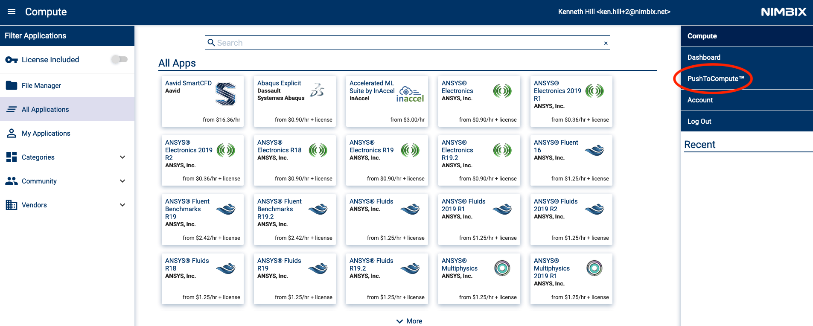

3. Login to the Docker Registry on the left
    
    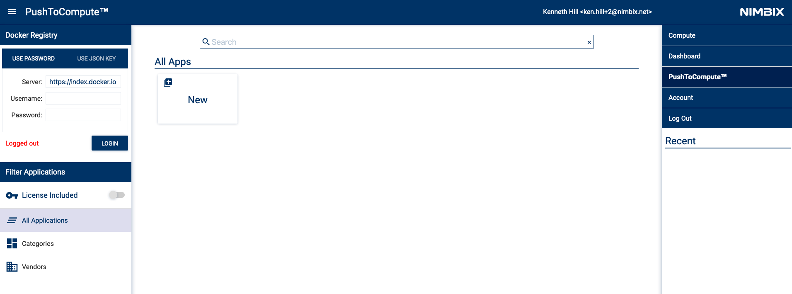

4. Create a new JARVICE application by clicking the New card
5. Fill in the `App ID` and `Docker Repository` information and select `OK`

    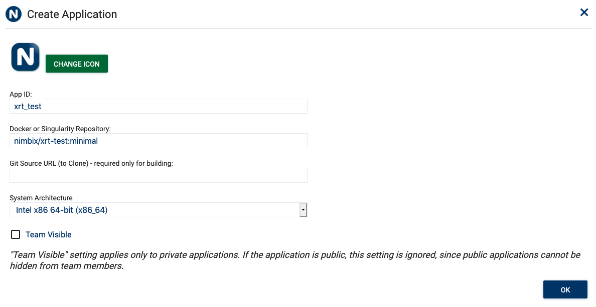

    **Note**: Fill in the correct information for your `Docker Repository`

6. Open the application menu by selecting the stacked icon on the upper left

    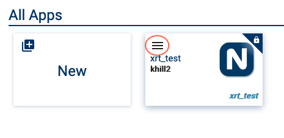

7. Select `Pull` to pull the Docker image from the Docker registry

    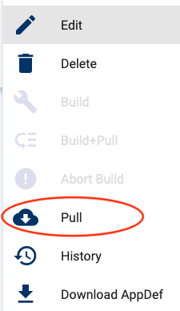

8. Click `OK` to confirm the pull request

    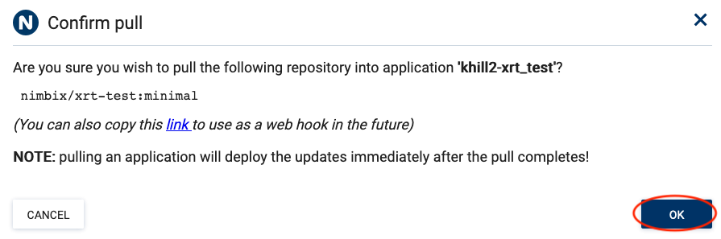

9. Open the application menu and select `History`
10. Wait for the `Pull` request to complete

Congratulations! You now have a custom JARVICE App w/ Xilinx Runtime for Alveo.


### Start JARVICE XRT App

1. Open the PushToCompute tab

    

2. Click on the `xrt_test` application card
3. Select the `Server` workflow.

    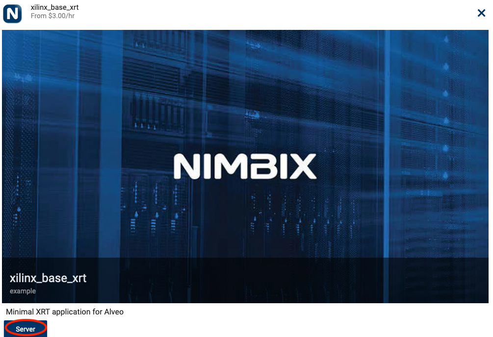

4. Select the desired `Machine type` and `SUBMIT` the job. This will redirect to the JARVICE Dashboard

    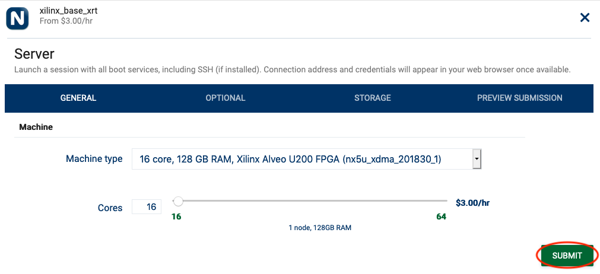

5. Examples on this page are limited to 30 minutes of compute time. Click `OK` to continue. <br>See **NOTES** at the end of the page for additional information

    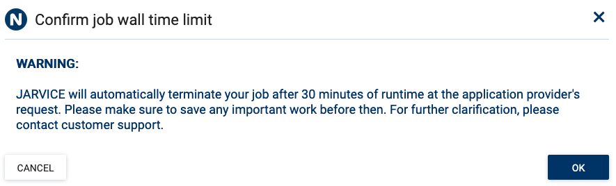

6. Wait for the job to start and click on `Click here to connect` (can take a few minutes).

    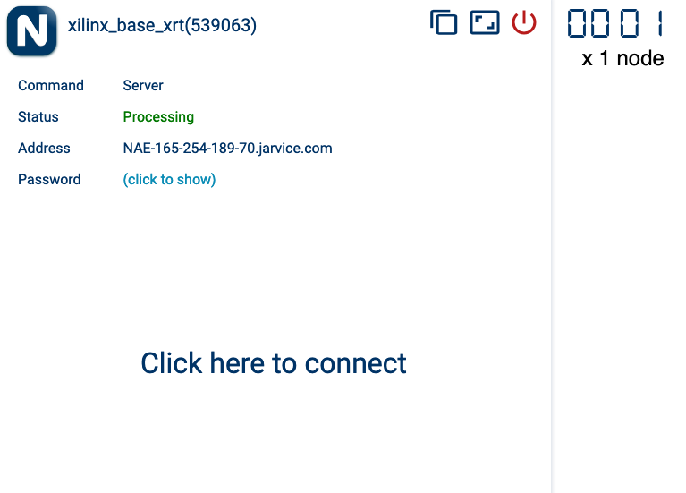

#### For minimal XRT Apps

You will now be connected to a gotty terminal for your job. Perform a DMA test on the Alveo accelerator:

```bash
# Configure bash w/ the XRT environment
source /opt/xilinx/xrt/setup.sh
# List the available Alveo accelerators
xbutil list
# Run the DMA test on the first Alveo accelerator
xbutil dmatest
```

Sample output:

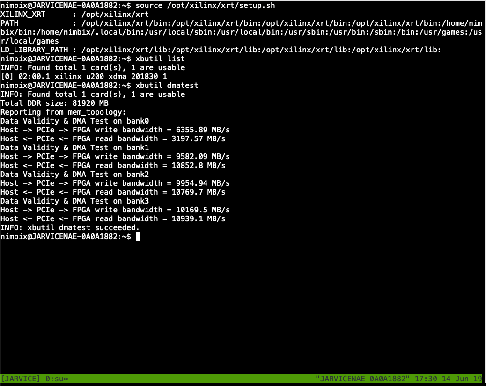

Shutdown the job on the JARVICE Dashboard by clicking the shutdown button on the App card

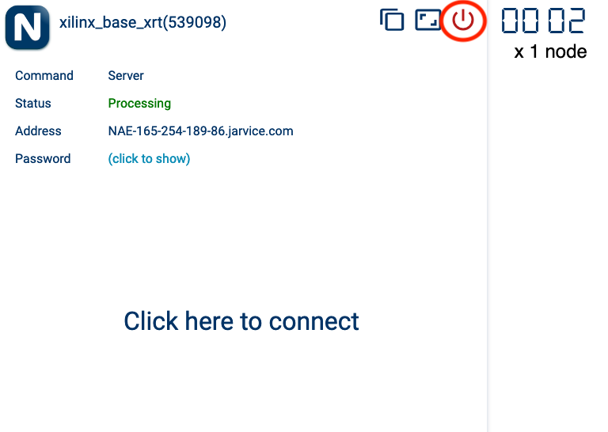


You now have a base XRT image that can be customized for your Alveo workflow. Edit the existing `Dockerfile` and `AppDef.json` to add your software and `*.xclbin` files to create your own JARVICE accelerated application.

#### For Desktop XRT Apps

You will now be connected to a desktop environment for your job. Perform a DMA test on the Alveo accelerater:

1. Open a terminal

    

2. Run the DMA test

```bash
# Configure bash w/ the XRT environment
source /opt/xilinx/xrt/setup.sh
# List the available Alveo accelerators
xbutil list
# Run the DMA test on the first Alveo accelerator
xbutil dmatest
```

Shutdown the job on the JARVICE Dashboard by clicking the shutdown button on the App card


You now have a base XRT image that can be customized for your Alveo workflow. Edit the existing `Dockerfile` and `AppDef.json` to add your software and `*.xclbin` files to create your own JARVICE accelerated application.

#**NOTES** 

* `Dockerfile` and `Appdef.json` exist in your working directly. You do not need to use `build-xrt.sh`. The files can be edited directly and built with `docker build`.
* The examples on this page are limited to a 30 minute of compute time. Remove `"walltime": "00:30:00",` from `AppDef.json` for Apps that do not require a compute limit.
