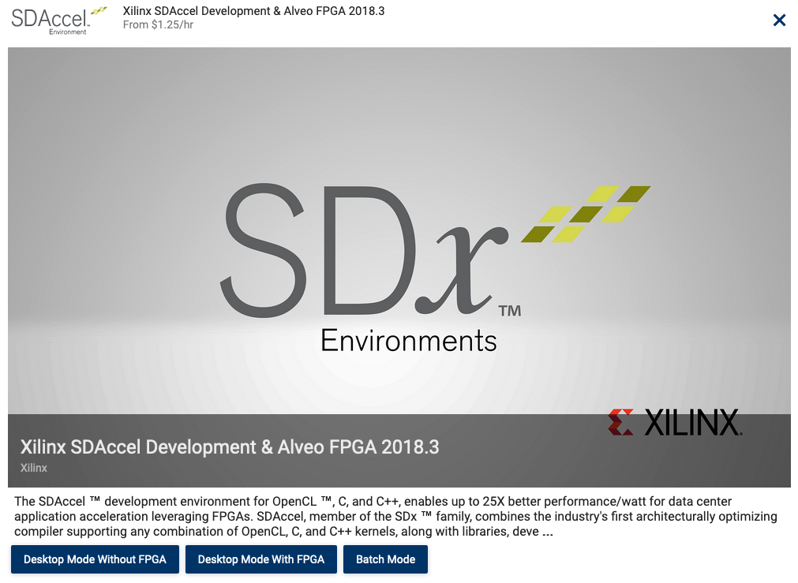
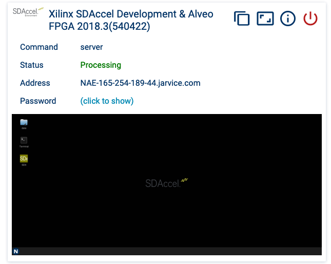
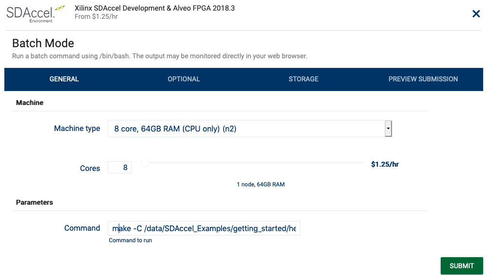
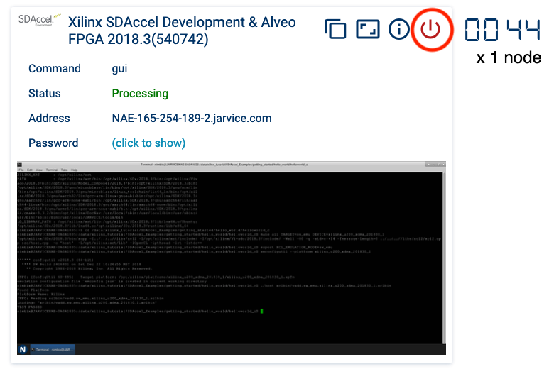

# Introduction

The SDAccel Environment, a member of the SDx™ family of development environments for systems and software engineers, enables up to 25X better performance/watt for data center application acceleration leveraging FPGAs. Nimbix Inc® has partnered with Xilinx® to deliver an opportunity to test drive SDAccel and see how FPGA-based acceleration can speed-up your OpenCL C, C/C++ and RTL Kernels. The Nimbix Cloud provides a purpose-built compute cloud for big data and computation. It now hosts the SDAccel development environment for companies who want to streamline evaluations and accelerate FPGA kernels. 

Nimbix offers a variety of FPGA resources including the [Alveo Accelerator card](https://www.xilinx.com/products/boards-and-kits/alveo.html). See full list of available hardware here: [Xilinx FPGAs on Nimbix](boards.md)

# Design Examples

A variety of examples are available on the [Xilinx GitHub](https://github.com/Xilinx/SDAccel_Examples)

## Hello World

This page will ues a simple example to walkthrough the SDAccel tools and runtime available on the [JARVICE](https://www.nimbix.net/platform/) platform which powers the NIMBIX cloud. 

### Start new SDAccel session on JARVICE

1. Login to the [JARVICE portal for Xilinx](https://xilinx-cloud.jarvice.com/)
2. Review the JARVICE environment:
    * [JARVICE Runtime Directories](https://jarvice.readthedocs.io/en/latest/nae/#runtime-directories-and-files)<br>**NOTE:** Only data in a user's vault is persistent between jobs. NIMBIX recommends using `/tmp` for best I/O performance (resulting data must be copied back to your vault before terminating the job). Please refer to `JARVICE Runtime Directories` for additional information
    * [Transferring Data](https://nimbix.zendesk.com/hc/en-us/articles/115004155683-How-to-Transfer-Data-to-and-from-Nimbix)
    * [Onboarding](https://nimbix.zendesk.com/hc/en-us/categories/115000891926-Onboarding)
3. Click on `Xilinx SDAccel Development & Alveo FPGA 2018.3` application

    

4. Select the `Desktop Mode Without FPGA` option

    

5. `SUBMIT` the job.
6. Click on the Desktop Preview to join the SDAccel session

    

### Clone SDAccel Examples for 2018.3

7. Open terminal
8. Clone `Hello World` into your vault
```bash
git clone --branch 2018.3 --depth=1 https://github.com/Xilinx/SDAccel_Examples /data/SDAccel_Examples
```  

### SDAccel SW emulation

Like most accelerators, there are separate binaries for the host software and accelerated kernel. The SDAccel compiler will compile C/C++/VHDL/Verilog source into an `*.xclbin` binary for the Alveo accelerator card. The compilation process for FPGAs can exceed several hours to create a custom architecture for a design. To alleviate compilation times, SDAccel provides a software (sw_emu) and hardware (hw_emu) emulator to test and verify kernel designs. This section will go over using the software emulator.

1. Open a terminal
2. Compile kernel for sw emulation
```bash
# Create local build directory in /tmp
TMP_WORK_DIR=$(mktemp -d)
# Compile for SW emulation
cd /data/SDAccel_Examples/getting_started/hello_world/helloworld_c
make all BUILD_DIR=${TMP_WORK_DIR} TARGET=sw_emu DEVICE=xilinx_u200_xdma_201830_1
```
### Run test with software emulator
```bash
# Setup environment for SW emulation
export XCL_EMULATION_MODE=sw_emu
emconfigutil --platform xilinx_u200_xdma_201830_1 --nd 1
# Run emulation test (not on Alveo hardware)
./host xclbin/vadd.sw_emu.xilinx_u200_xdma_2018301.xclbin
```

### Compile for Alveo hardware

1. Click on `Xilinx SDAccel Development & Alveo FPGA 2018.3` application

    

2. Select the `Batch Mode` option

    

3. Fill in the `Command` box with:
```bash
TMP_WORK_DIR=$(mktemp -d) && make -C /data/SDAccel_Examples/getting_started/hello_world/helloworld_c all BUILD_DIR=${TMP_WORK_DIR} TARGET=hw DEVICE=xilinx_u200_xdma_201830_1
```

   

A batch (non-interactive) job will start on the JARVICE Dashboard to build the Hello World `*.xclbin` file. This job will shutdown after completion. The `*.xclbin` file will be saved in the vault at `/data/SDAccel_Examples/getting_started/hello_world/helloworld_c/xclbin`

**NOTE** Ensure data is being written to the vault `/data` when using batch/non-interactive jobs. All other data (e.g. written to `${HOME}`) will be lost when the job ends.

### Run Hello World on Alveo

1. Click on `Xilinx SDAccel Development & Alveo FPGA 2018.3` application

    

2. Select the `Desktop Mode With FPGA` option

    

3. Open terminal and run `Hello World`
```bash
# List available Xilinx accelerators
xbutil list
# Get general info
xbutil query
# Run Hello World
cd /data/SDAccel_Examples/getting_started/hello_world/helloworld_c
./host xclbin/vadd.hw.xilinx_u200_xdma_201830_1.xclbin
``` 
### Shutdown SDAccel

   

